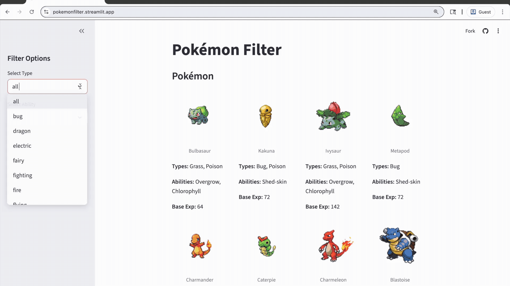

# pokemon-character-filter
A Python web app used to dynamically filter Pokémon characters.
---

## 🎥 Demo

## 🛠️ Tech Stack
**Language:** Python

**Web App Framework:** Streamlit

**RESTful API:** PokéAPI

**Libraries:** requests, pandas, concurrent.futures

## ✨ Features
- Displays Pokémon with images, types, abilities, and base experience
- Interactive sidebar filters for type and ability
- Concurrent requests for faster data fetching
- Responsive grid layout for displaying results

## 🔮 Future Improvements
- Favorites list or custom team builder
- Improved UI with search bar
